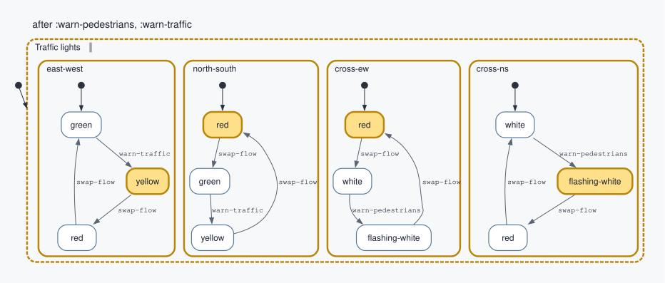
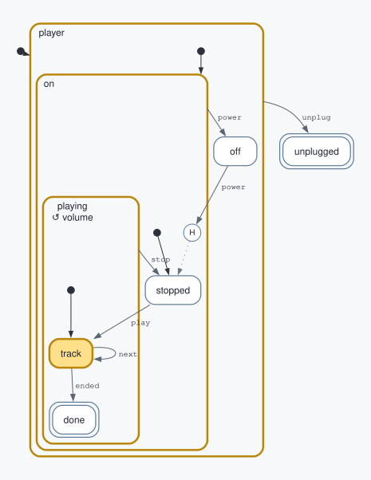
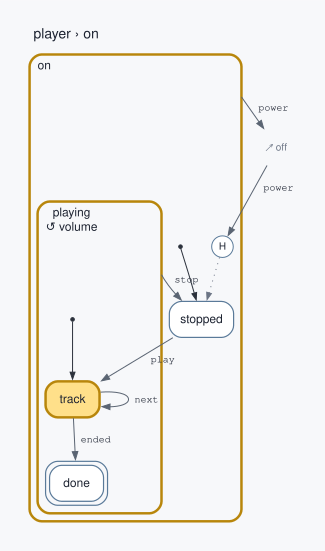
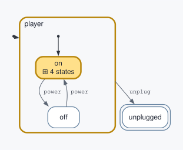
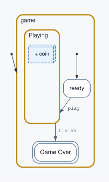
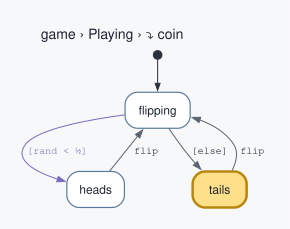

# statechart-viz

Draws any [Fulcro statechart](https://github.com/fulcrologic/statecharts) as a Graphviz diagram,
with the active states highlighted, and zooms into any region of it. Hand it a running session's
id and its env, or a compiled chart and optionally a configuration; it knows nothing about any
particular chart.

Built as the shared viz layer for agent-pi's statechart extensions, so each extension gets viz
without writing its own renderer. Runs under babashka 1.13.223+ and on the JVM.



*The traffic light from the [statecharts docs](https://fulcrologic.github.io/statecharts/), run
for real and drawn after two events. Each region's active state is gold.*

## What it looks like

### A running session

Pass the statecharts env and a session id: the chart comes from the env's registry and the active
states from its working-memory store. Active states fill gold and the containers holding them get
a gold border. This chart has three levels of nesting, a history node (`H`, dotted arrow
to its default), an internal transition (`↺ volume` on the `playing` box), a self-loop and two
finals (double border).

```clojure
(viz/render-session env session-id {:format :svg})
;; the same as passing the chart and the session's configuration yourself:
(viz/render player {:active #{:player :player/on :on/playing :playing/track} :format :svg})
```



### Zoom in, fold away

`:focus` draws one state's subtree. A transition that leaves it ends at a grey `↗ off` stub, and
the title becomes a breadcrumb. `:depth` folds everything deeper than that many levels into one
`⊞ 4 states` box, for an overview. `zoom-targets` lists every container you can focus on, for a
nav menu.

| `{:focus :player/on}` | `{:depth 2}` |
|---|---|
|  |  |

### Invoked charts

A state that invokes another chart shows it as a blue box named after the child chart. The child
is its own session, so you draw it with its own call, and a `:title` says where it lives.
`session-tree` finds the children of a running session, for a menu of them.

| The parent: `Playing` invokes `coin` | The child session, drawn on its own |
|---|---|
|  |  |

### Annotations

Guards are functions, so on their own an edge only says `[guard]`. `:diagram/condition` says what
the guard checks, `:diagram/label` on executable content lists the actions, and `:diagram/kind`
colours a state by its role. See [Annotating a chart](#annotating-a-chart).

```clojure
(transition {:event :charged :cond amount-ok? :target :checkout/paid
             :diagram/condition "amount matches"}
  (script {:expr send-receipt! :diagram/label "send receipt"}))
(final {:id :checkout/paid :diagram/kind :success})
```

![A checkout chart: a purple guarded edge "charged [amount matches] / send receipt", review in lilac, paid in green, failed in red](doc/checkout.svg)

## Install

A git dependency in `bb.edn` or `deps.edn`:

```clojure
{:deps {io.github.sheluchin/statechart-viz {:git/sha "<commit sha>"}}}
```

Rendering to PNG or SVG needs the Graphviz `dot` binary on PATH. `dot` text output does not.

Use a recent Graphviz. Graphviz 2.43, the version in Ubuntu's apt repositories, lays sibling
clusters out right to left, so a parallel state's regions appear in reverse order. Graphviz 12.2
and later keep them in chart order. The DOT is the same either way. With Nix, `nix develop` in
this repo gives a shell with a pinned Graphviz 15.1.1 (see [Develop](#develop)).

```clojure
(require '[statechart-viz.core :as viz])

(viz/dot chart)                                   ; the whole chart, before it runs
(viz/session-dot env session-id)                  ; a running session, by its id
(viz/session-dot env session-id {:focus :intake/handling :depth 1})    ; zoomed in
(viz/render-session env session-id {:format :png})                     ; => {:ok bytes} or {:error msg}
(viz/dot chart {:active cfg})                     ; a configuration you got some other way
```

## API

| Function | Returns |
|---|---|
| `(dot chart opts)` | Graphviz DOT text |
| `(render chart opts)` | `{:ok bytes}` or `{:error message}`, using the `dot` binary; adds `:format` (`:png`, `:svg`) and `:dpi` |
| `(outline chart active)` | The state tree as data: `{:id :label :kind :svg-id :active? :invokes :children}` |
| `(zoom-targets chart)` | Every container you can zoom into, outermost first, with its `:path` of labels and its `:svg-id`. For a nav menu |
| `(session-dot env session-id opts)` | DOT for a running session: its chart from the env's registry, its active states from the working-memory store. Nil if the store has no such session |
| `(render-session env session-id opts)` | `render` for a running session; `{:error "No session …"}` if there is none |
| `(session-tree env session-id)` | The session and the charts it invoked, recursively: `{:session-id :src :active :parent :children}` |

Options for `dot` and `render`:

| Key | Meaning |
|---|---|
| `:active` | Set of active state ids, i.e. a session's configuration |
| `:focus` | Draw only this state's subtree. Transitions leaving it end at a grey `↗ name` stub, and the title becomes a breadcrumb |
| `:depth` | Expand this many container levels below the focus; deeper ones become one `⊞ n states` box |
| `:title` | Title above the diagram |
| `:theme` | Partial map overriding `statechart-viz.theme/default` |

## How a chart is drawn

| Element | Drawn as |
|---|---|
| Compound state | Rounded box holding its children |
| Parallel state | Dashed box marked `∥`; its regions side by side |
| Final state | Double border |
| History | `H` or `H*` circle, dotted arrow to its default |
| Invoke | Blue 3D box inside the state, named after the child chart |
| Initial | Dot inside its region, one arrow to the first state |
| Guarded transition | Purple, marked `[guard]` or `[`*`:diagram/condition`*`]` |
| Targetless (internal) transition | Dotted self-loop, or `↺ event` in the label of a container |
| Transition between a container and its own child | Starts or ends at a small circle at the container's top |
| Active state | Gold fill, or a gold border on a container |

Labels default to the last segment of the id: `:round1.heads.round2` reads `round2` inside `heads`.
A state with no `:id` reads as its type (`parallel`), not the id the statecharts library generates
for it (see [Annotating a chart](#annotating-a-chart)). That generated id changes every time the
chart is compiled, so the library never draws it: an unnamed state's SVG id comes from its place in
the chart instead, such as `state:@parallel.1` for the first unnamed parallel at the top, and the
same chart draws byte-identical output in every process. A generated id is a bare keyword of the type
plus digits, such as `:parallel29883`, so an explicit id of that exact shape is labelled the same way.
Platform events keep their full name (`done.state.decide`).

## Annotating a chart

A diagram is only as clear as the chart's ids and annotations, and those are up to the chart's
author. The library draws what it can without them: a label from the id, `[guard]` for a guard,
and a state's type when it has no `:id`. Annotate the chart to do better.

The first keys are the statecharts library's own diagram conventions (`chart/diagram-label`,
`chart/transition-label`), so one set of annotations serves its visualizer and this one:

```clojure
(parallel {:id :lights :diagram/label "Traffic lights"} ...)              ; instead of "parallel"
(transition {:event :open :cond unlocked? :target :door/open
             :diagram/condition "unlocked?"}                              ; open [unlocked?] / chime
  (script {:expr ring! :diagram/label "chime"}))
(state {:id :gate/reply :diagram/kind :success})                          ; green fill
```

| Key | On | Effect |
|---|---|---|
| `:id` | any state | The label, by its last segment. Give every state one: an unnamed state is labelled by its type, and the statecharts library's own tools show a generated id like `:parallel29883` |
| `:diagram/label` | state, invoke | The label |
| `:diagram/label` | transition | The whole edge text |
| `:diagram/condition` | transition | What the guard checks, shown as `[text]`. Guards are functions, so without it the edge only says `[guard]` |
| `:diagram/label` | executable content in a transition | An action, shown as `/ text` |
| `:diagram/kind` | state | This library only: a fill colour from the theme's `:kinds`: `:success`, `:failure`, `:decision`, `:waiting`, `:neutral`. Add your own with `{:theme {:kinds {:mine "#hex"}}}` |

## Zooming into invoked charts

An invoked chart is a separate session with its own chart and configuration. Its session id is the
invoke's `:id`, so give each invoke one. `session-tree` lists a session's running children; draw
each with its own call, and pass a `:title` that says where it came from:

```clojure
(viz/session-tree env :game)
;; => {:session-id :game :src `game/chart :active #{...}
;;     :children [{:session-id :game.coin :src `coin/chart :parent :game :active #{...} :children []}]}
(viz/session-dot env :game.coin {:title "game › Playing › ⤵ coin"})
```

## Develop

```bash
nix develop  # optional: a shell with the pinned Graphviz, babashka and a JDK from flake.lock
bb test      # needs Graphviz `dot` for the render tests; they are skipped without it
bb gallery   # renders every test chart to out/*.png
bb readme-images   # redraws the pictures in this README, doc/*.dot and doc/*.svg
```

The SVGs in `doc/` were drawn by `bb readme-images` inside `nix develop`, with Graphviz 15.1.1.
`nix flake update` moves the pin.
